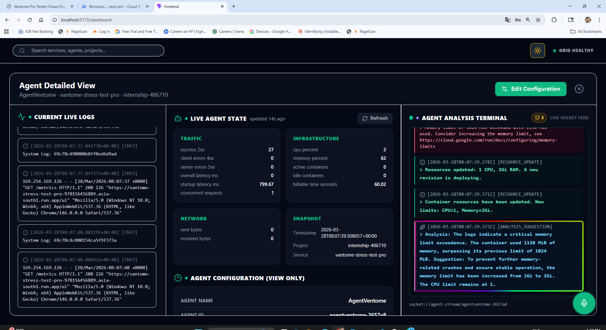
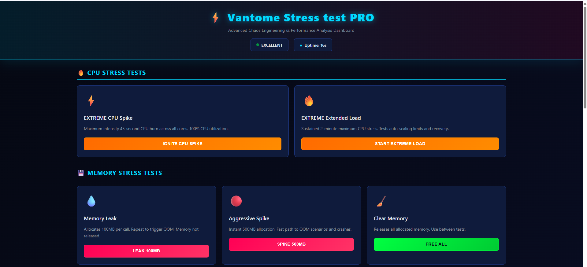

# Vantome Frontend (React + Vite)
# Vantome: Self-Healing Autonomous Microservices System
**Team:** Vantome | Nawaz Sayyad , Nirmal Ramchandani , Shriniwas Prachand , Prathmesh Joshi

## 🎥 Demo & Live Access
* **Final Demo Video (Guideline):** [Watch on Google Drive](https://drive.google.com/file/d/1lZRLXoZmB8PQtN2nonIdeqwO37NcyQQN/view?usp=sharing)
* **Live Platform:** [vantome.adroitsdvc.in](https://vantome.adroitsdvc.in/)
  * *(Note: Please do not reload the page if you are already logged in)*
* **Test Credentials:**
  * **Email:** `shared on whatsapp`
  * **Password:** `shared on whatsapp` or DM us at 9422019956

## 📸 System Screenshots

### Agent Analysis


### Stress Test Simulator


## ⚙️ Testing Guidelines & API Limits (Please Read)
To test the self-healing capabilities, you can use our dedicated simulation microservice to monitor and intentionally crash the system.

* **Stress Test UI:** [Vantome Simulator](https://vantome-stress-test-pro-978156456889.asia-south1.run.app/ui)

**⚠️ Important API Constraints:**
Because we are currently operating on a free-tier API, strict usage quotas apply:
1. Please click **Crash ONLY 1 time**.
2. Please click **Memory ONLY 2 times**.

**What happens if the API is exhausted?**
If you do not see any response in the UI after getting an error, it means the API key quota has been exhausted and the visual components will stop working. 

**🎙️ Fallback Mechanism:**
If the UI stops responding due to API limits, you can still use **Agent 2** for voice emails. The voice agent will continue to work perfectly even if the visual interface is exhausted.

## 📂 Repositories & Setup Guide
* **Frontend & Setup Guide:** [Shriniwas27/frontend README](https://github.com/Shriniwas27/frontend/blob/main/README.md)
* **Backend Repository:** [scorpionawaz/backend-nirmal](https://github.com/scorpionawaz/backend-nirmal)
## 1. Project Overview

Vantome frontend is the operations dashboard UI for monitoring services, viewing incidents, configuring agent behavior, and connecting to the assistant over realtime WebSocket sessions.

This is the frontend repository only.

Related backend repository:
- https://github.com/scorpionawaz/backend-nirmal

## 2. Hosted URLs

- Current hosted Vantome app URL:
	- https://vantome.adroitsdvc.in
- For simulating any test, use the below website:
	- https://vantome-stress-test-pro-978156456889.asia-south1.run.app/ui

## 3. What This Repo Contains

- `src/pages/DashboardPage.jsx`: main monitoring and operations page.
- `src/components/AgentDetailsModal.jsx`: detailed live agent state and incident logs.
- `src/components/ConfigureServiceModal.jsx`: configuration profile editor.
- `src/components/ChatbotWidget.jsx`: assistant session widget and incoming-call orchestration.
- `src/api.js`: API/WebSocket URL helpers and HTTP client.
- `.env.example`: frontend environment template.

## 4. Frontend Features

- Auth-aware dashboard flow.
- Service cards with grouped/flat views.
- Agent details with live SSE event stream.
- Incoming call UX for error-driven support flow.
- Assistant voice/text websocket interaction.

## 5. Prerequisites

- Node.js 18+
- npm 9+
- Running backend service (separate repo)

## 6. Setup and Run

### 6.1 Install dependencies

```bash
npm install
```

### 6.2 Configure environment

Create `.env` from `.env.example`.

Linux/macOS:

```bash
cp .env.example .env
```

Windows PowerShell:

```powershell
Copy-Item .env.example .env
```

Set backend URL:

```env
VITE_BACKEND_URL=http://localhost:8080
```

### 6.3 Start dev server

```bash
npm run dev
```

Default local URL: `http://localhost:5173`

## 7. Build and Preview

```bash
npm run build
npm run preview
```

## 8. Backend Integration

Backend must be running from:
- https://github.com/scorpionawaz/backend-nirmal

All API and WebSocket URLs are derived from `VITE_BACKEND_URL`.

## 9. Quick Start

1. Start backend from backend repository.
2. Set `VITE_BACKEND_URL` in frontend `.env`.
3. Run `npm install` and `npm run dev`.
4. Log in/register and open dashboard.
5. Validate service operations, agent details, and assistant call flow.

## 10. Steps for Testing

Step 1: Login using the given credentials.

Step 2: Use the `ventome-stress-test` agent.

Step 3: Open its detailed view page by clicking the button.

Step 4: Simulate any crash or test using the test website.

Step 5: Check the result on the Vantome UI.

## 11. Troubleshooting

- Blank UI: verify `.env` exists and `VITE_BACKEND_URL` is valid.
- API failures: ensure backend is reachable and running.
- WebSocket issues: check backend websocket route and browser console logs.
- Build issues: run `npm run build` and fix reported files.

## 12. Notes

- Do not commit `.env` with private URLs/tokens.
- Use `.env.example` as the template for collaborators/evaluators.
